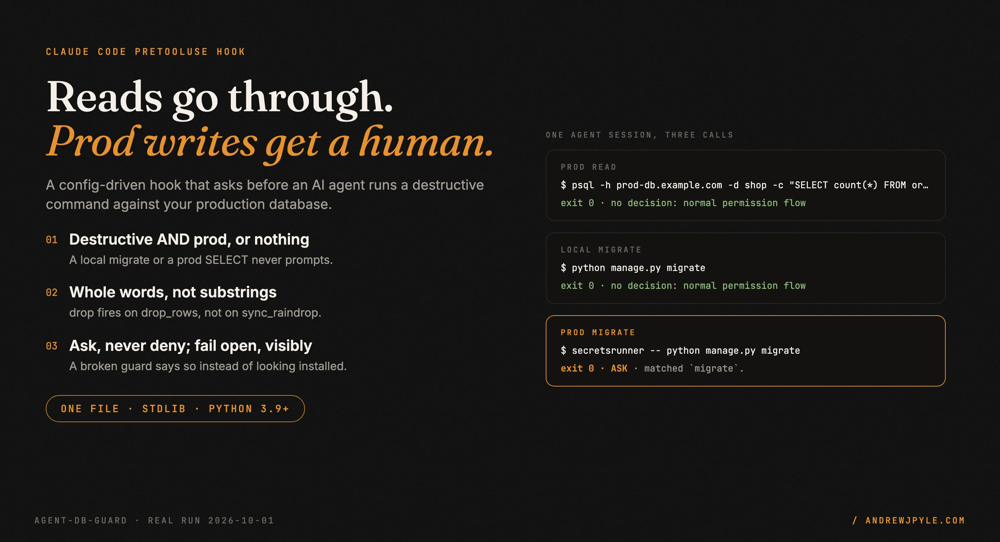
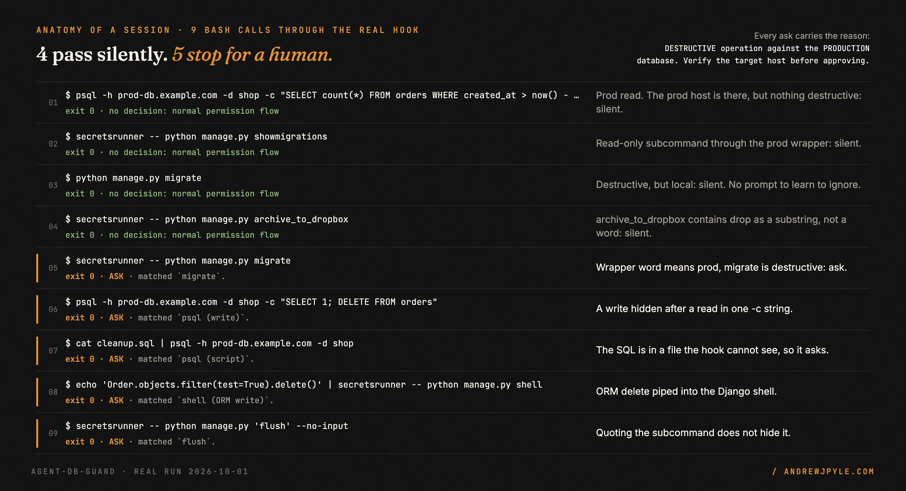
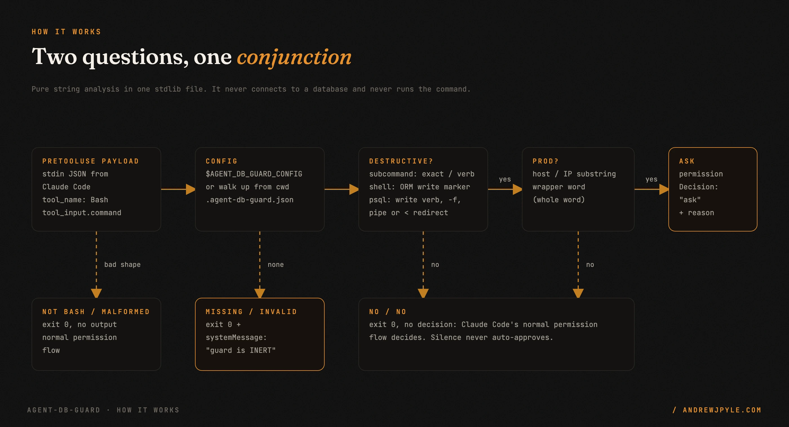
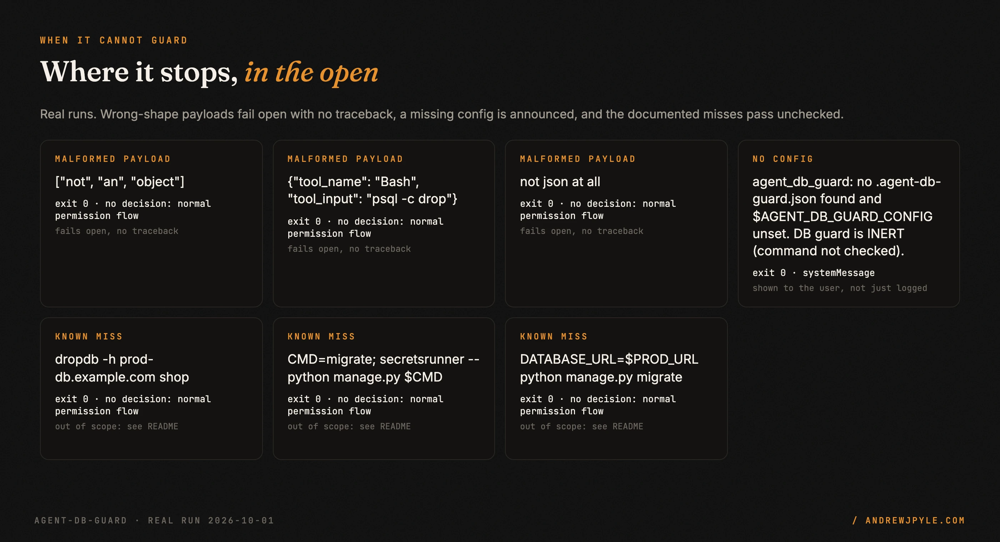

<p align="center">
  
</p>

<p align="center">
  <a href="https://github.com/andrewjpyle/agent_db_guard/actions/workflows/ci.yml"></a>
  
  
  
</p>

# A Claude Code hook that asks before an agent writes to your prod database

Coding agents run shell commands. Sooner or later one runs a migration, a `TRUNCATE` or a
`flush` and points it at production. The same command is harmless against a local database, and
nothing in its shape says which one it hit. `agent_db_guard` is a `PreToolUse` hook that reads
each Bash command before it runs and asks you first when the command is **both** destructive
**and** aimed at production.

- **Destructive AND prod, or nothing.** A prod `SELECT` passes. A local `migrate` passes. Only the
  combination stops.
- **Whole words, never substrings.** `drop` fires on `drop_stale_rows`, not on `sync_raindrop`.
- **It asks; it never denies.** A reviewed prod migration stays possible. The hook returns
  `"ask"` and a reason, and you approve or reject.
- **Fails open, visibly.** A broken payload never bricks the agent's shell, and a guard with no
  usable config tells you so instead of looking installed.
- **One file, standard library only.** `agent_db_guard.py`, 367 lines, Python 3.9+. No pip.

> **The one idea worth stealing, even if you never run this code:** gate on the conjunction,
> not the keyword. A guard that prompts on every `migrate` gets clicked through by Friday, and
> then it waves through the one that hit prod. Before: "ask on any destructive command" (dozens
> of prompts a day, all dismissed). After: "ask on destructive AND prod" (a prompt is rare, so
> it gets read).

---

## 60 seconds to a real session

No install and no database. The demo replays a recorded agent session (fictional company,
fictional host `prod-db.example.com`) through the real hook, one process per call, exactly the
way Claude Code runs it:

```bash
git clone https://github.com/andrewjpyle/agent_db_guard.git
cd agent_db_guard/examples/demo
python3 replay.py session.jsonl
```

Real output ([capture](docs/assets/src/captures/session.json)), trimmed to five of nine calls:

```
[01] $ psql -h prod-db.example.com -d shop -c "SELECT count(*) FROM orders WHERE created_at > now() - interval '1 day'"
     exit 0 | no decision: normal permission flow
[03] $ python manage.py migrate
     exit 0 | no decision: normal permission flow
[04] $ secretsrunner -- python manage.py archive_to_dropbox
     exit 0 | no decision: normal permission flow
[05] $ secretsrunner -- python manage.py migrate
     exit 0 | ASK
       DESTRUCTIVE operation against the PRODUCTION database. Verify the target host before approving.
       Matched destructive operation: `migrate`.
[07] $ cat cleanup.sql | psql -h prod-db.example.com -d shop
     exit 0 | ASK
       DESTRUCTIVE operation against the PRODUCTION database. Verify the target host before approving.
       Matched destructive operation: `psql (script)`.
```

<p align="center"></p>

What Claude Code actually receives for call 05 is this, on stdout, with exit code 0
([capture](docs/assets/src/captures/hook_ask_raw.json)):

```json
{"hookSpecificOutput": {"hookEventName": "PreToolUse", "permissionDecision": "ask", "permissionDecisionReason": "DESTRUCTIVE operation against the PRODUCTION database. Verify the target host before approving.\n\nMatched destructive operation: `migrate`."}}
```

A command that is not destructive-and-prod gets no output at all. Silence is not an approval:
the call goes through Claude Code's normal permission flow, exactly as if the hook were absent.

## Wire it to your real setup

1. Put `agent_db_guard.py` anywhere.
2. Copy an example to your project root as `.agent-db-guard.json` and **edit `prod_signals` to
   match your production database.** [`examples/django.agent-db-guard.json`](examples/django.agent-db-guard.json)
   covers `manage.py` and `django-admin`; [`examples/generic.agent-db-guard.json`](examples/generic.agent-db-guard.json)
   covers raw `psql` plus a custom CLI.
3. Register it as a `PreToolUse` hook for Bash in your Claude Code settings:

```json
{
  "hooks": {
    "PreToolUse": [
      { "matcher": "Bash",
        "hooks": [ { "type": "command", "command": "python3 /abs/path/agent_db_guard.py" } ] }
    ]
  }
}
```

The config is found from `$AGENT_DB_GUARD_CONFIG` if set, otherwise by walking up from the
working directory to the first `.agent-db-guard.json`.

### Configuration

| Key | What it means | Matched as |
|---|---|---|
| `destructive.exact_subcommands` | subcommands that always mutate the DB (`migrate`, `flush`, `loaddata`) | exact name, any case |
| `destructive.verbs` | words that make a custom subcommand destructive (`seed`, `drop`, `backfill`) | whole word inside the name: `drop_rows` yes, `sync_raindrop` no |
| `destructive.subcommand_pattern` | regex whose group 1 is the subcommand. Default `manage\.py\s+([a-zA-Z_][\w-]*)` | regex, case-insensitive |
| `destructive.shell_subcommands` | subcommands that take Python (`shell`, `shell_plus`) | exact name |
| `destructive.orm_write_markers` | text that marks an ORM write in that Python (`.delete(`, `bulk_create`) | substring anywhere in the command |
| `destructive.sql_write_verbs` | SQL verbs that make a `psql` call a write (`delete`, `drop`, `truncate`) | whole word, any case, anywhere in the command |
| `prod_signals.substrings` | text that means prod: your prod host, its IP | substring, any case |
| `prod_signals.wrapper_words` | a runner that always means prod in your setup (a secrets injector whose only config is prod, `aws-vault`) | whole word |
| `message` | the first line of the ask reason | |

`psql` is also treated as destructive, regardless of SQL verbs, when it runs a script the hook
cannot read: `-f`/`--file`, a `< file` redirect, or a pipe from anything other than
`echo`/`printf`. The same goes for a management shell fed from a file.

### When the guard is not guarding

If no config is found, the config is invalid, or it declares no destructive rule or no prod
signal, the hook lets the command through and says so in a `systemMessage`, which Claude Code
shows to the user ([capture](docs/assets/src/captures/hook_inert_raw.json)):

```json
{"systemMessage": "agent_db_guard: no .agent-db-guard.json found and $AGENT_DB_GUARD_CONFIG unset. DB guard is INERT (command not checked)."}
```

It also writes the line to stderr and to `~/.agent_db_guard.log`. Stderr alone would not be
enough: Claude Code sends a hook's stderr to its debug log when the hook exits 0, so a warning
there is one nobody reads.

## How it works

<p align="center"></p>

1. **Read the payload.** Claude Code pipes a JSON object to the hook's stdin. Anything that is
   not a Bash call with a string command exits 0 with no output.
2. **Load the policy.** From `$AGENT_DB_GUARD_CONFIG` or the nearest `.agent-db-guard.json`.
   Missing or invalid means a visible INERT warning, not a silent pass.
3. **Destructive?** The subcommand is checked against exact names and whole-word verbs; a
   management shell against ORM write markers; `psql` against SQL write verbs and script input.
   The command is checked both as written and with quotes and backslashes removed, so
   `manage.py 'migrate'` and `manage.py mi""grate` are seen as `migrate`.
4. **Prod?** A configured host or IP substring, or a wrapper word.
5. **Both yes:** print an `"ask"` decision with the reason. Otherwise print nothing.

It never connects to a database and never runs the command. It is string analysis over the
command line.

## Scope: what it does not do

<p align="center"></p>

- **It is a seatbelt, not a sandbox.** It catches an agent's honest mistake. An agent (or a
  person) trying to get past it can: hide the subcommand in a variable (`CMD=migrate; manage.py
  $CMD`), use `eval`, base64, or a script file it wrote a moment ago. If you need a hard
  boundary, give the agent credentials that cannot write to prod.
- **It only sees prod when the command says so.** `DATABASE_URL=$PROD_URL python manage.py
  migrate` passes, because the host is in a variable the hook cannot resolve. That is what
  `wrapper_words` is for: name the runner that always means prod.
- **It parses `psql` and one subcommand-style CLI.** `dropdb`, `pg_restore --clean`, `mysql` and
  `sqlite3` are not recognized ([capture](docs/assets/src/captures/limits.json) shows
  `dropdb -h prod-db.example.com shop` passing). Point `subcommand_pattern` at your own CLI, or
  extend the code.
- **It can over-ask on chained commands.** `python manage.py migrate && psql -h <prod> -c
  "SELECT 1"` asks, because the destructive part and the prod part are judged across the whole
  line. That errs toward a prompt, never toward a silent prod write.
- **It does not approve anything.** No output means the normal permission flow decides.

## The patterns

| Pattern | The failure it prevents |
|---|---|
| Gate destructive AND prod, not either alone | a prompt on every local migrate, clicked through until the one that hit prod is clicked through too |
| Whole-word matching | `drop` firing on `sync_raindrop` and `archive_to_dropbox`, one more prompt teaching you to ignore prompts |
| Ask, never deny | a wall that gets disabled the first time a real migration needs to run |
| Treat unreadable script input as a write | `cat cleanup.sql \| psql -h prod` slipping past a check that only reads inline SQL |
| Match the de-quoted command too | `manage.py 'migrate'` hiding a migration behind shell quotes |
| Fail open, but announce it in a `systemMessage` | a guard that looks installed while checking nothing, with its only warning in a debug log |
| Validate the config's shape | a typo in the JSON turning the guard off with no sign |

## FAQ

**Does it slow every Bash call?** It starts a Python process per call and does string matching;
there is no network or database access.

**What happens in `bypassPermissions` mode?** Claude Code's hook docs state that an `"ask"`
from a hook still shows the prompt in that mode.

**Why not `"deny"`?** Because the intentional prod migration has to stay possible, and a hook
that blocks it gets removed. `"ask"` puts a human in front of the command with the reason.

**Can I see what it decided?** Every ask is appended to `~/.agent_db_guard.log`, along with
INERT warnings and internal errors.

## Development

```bash
python3 -m unittest discover -s tests -v    # 42 tests, stdlib only
cd examples/demo && python3 replay.py session.jsonl
```

CI runs the suite on Python 3.9 to 3.13, fails if fewer than 42 tests run, and replays the demo
session asserting exactly 5 asks and 4 silent passes. The README graphics are built from the
committed captures in `docs/assets/src/captures/` by `docs/assets/src/build.py`.

## Roadmap

- Recognize `dropdb`, `pg_restore --clean` and `mysql` alongside `psql`.
- More than one `subcommand_pattern`, for projects with several CLIs.

## License

MIT. By [Andrew Pyle](https://andrewjpyle.com).

`agent_db_guard` is one of the parts pulled out of a larger autonomous build system and released
on its own. The rest are at **https://autonomousaj.com/parts**.
